# Vít Machač - web

> Osobní webová prezentace pro předmět **Webové technologie (2. ročník)**. Tmavé téma s vesmírnou atmosférou, akcent v jedné brand červené `#ad0808`, čisté HTML5 / CSS3 / vanilla JavaScript bez frameworků.

**Autor:** Vít Machač 
**Živý web:** [spagy69.github.io/new-website](https://spagy69.github.io/new-website/)

---

## 1. Úvod

`spagetak.com` je jednosouborová webová prezentace osobního vývojářského portfolia. Téma je *space exploration* - tlumený starfield, planetární horizont s tenkým červeným rimem, žádný glassmorfismus, gradient mesh, neon ani emoji. Vesmír zde funguje jako atmosférická metafora pro „práci v noci", ne jako sci-fi dekorace.

Web obsahuje sekce: **Hero** (jméno + typewriter s blikajícím kurzorem), **O mně** (s identifikační kartou a sekcí „Nyní hraje: RUST"), **Moje práce** (3 reálné projekty - herní mod, desktop overlay, tento web), **Dovednosti** (12 katalogových karet s Font Awesome ikonami), **Kontakt** (e-mail, GitHub, Discord s copy-on-click, doména).

Vedle hlavního obsahu obsahuje web několik **drobných easter eggů**: tajný puntík v rohu identifikační karty, který vypíše náhodnou hlášku; 5× klik na logo hry RUST odhalí doporučení; rozjíždějící se písmena „SPAGY" v hlavičce karty; rotující logo v navigaci při hoveru.

---

## 2. Použité technologie

| Vrstva | Technologie |
|---|---|
| Struktura | **HTML5** - sémantické značky (`<header>`, `<main>`, `<section>`, `<aside>`, `<article>`, `<footer>`, `<dl>`, `<dt>`, `<dd>`) |
| Styly | **CSS3** - Custom Properties (design tokeny), CSS Grid, Flexbox, `clamp()`, `@media` breakpointy, `prefers-reduced-motion`, `text-wrap`, keyframe animace, transform 3D |
| Skripty | **Vanilla JavaScript (ES6+)** - `IntersectionObserver`, `requestAnimationFrame`, Canvas 2D, `navigator.clipboard`, `MediaQueryList`, IIFE moduly |
| Typografie | Google Fonts (1 request): **Instrument Serif**, **Newsreader**, **Archivo**, **Bebas Neue** |
| Ikony | **Font Awesome 6.5.1** (CDN) - brand i solid ikony pro dovednosti |
| Grafika | Vlastní logo `spagy.webp`, favicon `favicon.webp`, ručně psané SVG šipky s `vector-effect` |

**IDE:** Visual Studio Code 1.120.0 s rozšířením *Live Server* pro hot-reload.
**Žádný framework, žádný build step, žádný balíček ze npm.**

---

## 3. Adresářová struktura

```
main/
├── index.html             # celý web - HTML + inline CSS + inline JS
├── spagy.webp             # logo (přezdívka)
├── favicon.webp           # favicon prohlížeče
├── rust-logo.webp         # logo hry RUST pro "Nyní hraje"
└── README.md              # tato dokumentace
```

Záměrně **jeden soubor** pro celý web - usnadňuje to deployment přes GitHub Pages (žádné build artefakty) a splňuje pravidlo „čisté webové technologie bez frameworků".

Vnitřní struktura `index.html`:

1. `<head>` - meta tagy, SEO, Open Graph, Twitter Cards, Google Fonts (preconnect + 1 stylesheet), Font Awesome CSS
2. `<style>` v hlavičce - design tokeny → reset → vrstvy pozadí (sky, canvas, vignette) → navigace → sekce → responsivní breakpointy → tweaks (palette / depth / typo varianty)
3. `<body>` - background vrstvy, `<header>` s navigací, `<main>` se sekcemi, `<footer>`
4. `<script>` na konci - mobilní nav, scroll observer, reveal animace, typewriter, počítadlo věku, hodiny, copy-on-click, hvězdné pole, easter eggy

---

## 4. Technický rozbor

Pro každou ze 6 oblastí optimalizace je uveden (a) teoretický popis řešení a (b) ukázka kódu.

### 4.1 Výkon (Performance)

**Teorie:** Hlavní zdroje pomalého načítání jsou síťové round-tripy (požadavky a odpovědi), blokující JavaScript a změny rozvržení při vykreslování (render reflows). Řešení v tomto projektu:

- **Minimum HTTP requestů** - HTML, CSS i JS jsou inline v jednom souboru. Externí je pouze Google Fonts (1 stylesheet) a Font Awesome (1 CSS).
- **Preconnect** - DNS lookup a TLS handshake pro `fonts.gstatic.com` proběhnou paralelně s parsováním HTML, což šetří ~150-300 ms.
- **Explicitní rozměry obrázků** - obrázky mají explicitně definovanou šířku (`width`) a výšku (`height`), čímž se předchází nechtěným posunům obsahu (Cumulative Layout Shift - CLS).
- **Respekt k `prefers-reduced-motion`** - animace hvězdného pole (canvas) se při zapnutém systémovém omezení pohybu vůbec nespustí, což šetří CPU a baterii na slabších zařízeních.
- **Optimalizované formáty** - všechny lokální obrázky na webu jsou ve vysoce komprimovaném formátu WebP.

**Kód:**

```html
<!-- preconnect provádí DNS + TLS handshake paralelně se stahováním stylesheetu -->
<link rel="preconnect" href="https://fonts.googleapis.com" />
<link rel="preconnect" href="https://fonts.gstatic.com" crossorigin />
<link href="https://fonts.googleapis.com/css2?family=Archivo:wght@300;400;500;600;700&family=Bebas+Neue&family=Instrument+Serif:ital@0;1&family=Newsreader:ital,opsz,wght@0,6..72,300;0,6..72,400;1,6..72,300;1,6..72,400&display=swap" rel="stylesheet" />

<!-- explicitní rozměry zabraňující posunům vzhledu (layout shift) -->
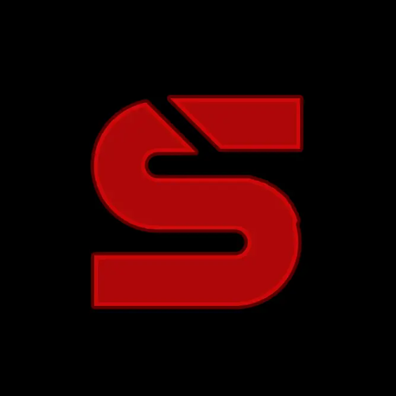
```

```js
// Když uživatel má v OS zapnuté "reduce motion", canvas hvězdné pole
// se vůbec nespustí - šetří CPU/baterii.
const reduce = window.matchMedia('(prefers-reduced-motion: reduce)').matches;
if (reduce) return;
```

### 4.2 SEO

**Teorie:** Vyhledávače (a náhledy odkazů při sdílení na sociálních sítích) vyžadují: jasný `<title>`, výstižný `<meta description>`, jazykový atribut `lang`, kanonickou URL adresu přes `<link rel="canonical">` a sémantickou strukturu HTML s logickou hierarchií nadpisů (právě jeden `<h1>` na stránku, dále `<h2>` pro hlavní sekce a `<h3>` pro položky uvnitř).

**Kód:**

```html
<html lang="cs">
<head>
  <title>Vít Machač · Spagy · Vývojář</title>
  <meta name="description" content="Vít Machač (Spagy), sedmnáctiletý vývojář z Česka. Stavím malé, spolehlivé nástroje. Kontakt: vit.machac@spagetak.com." />
  <meta name="keywords" content="Vít Machač, Vit Machac, Spagy, spagetak, vývojář, developer, frontend, vanilla javascript, portfolio, Česko" />
  <meta name="author" content="Vít Machač" />
  <link rel="canonical" href="https://spagetak.com/" />
</head>

<body>
  <main id="top">
    <section class="hero" aria-labelledby="heroName">
      <h1 class="hero__name" id="heroName" data-reveal>Vít Machač</h1>
    </section>
    <section class="section" id="about" aria-labelledby="aboutH">
      <h2 id="aboutH">O mně</h2>
    </section>
  </main>
</body>
```

### 4.3 Přístupnost (Accessibility - WCAG)

**Teorie:** Klíčové oblasti přístupnosti pro handicapované uživatele:

1. **Dostatečný kontrast** - text má kontrastní poměr alespoň 4.5:1 vůči pozadí (kritérium WCAG AA).
2. **Přístupnost z klávesnice** - celým webem lze procházet pomocí tabulátoru (`Tab`) a všechny aktivní prvky mají jasně viditelné ohraničení při zaměření (focus state).
3. **Čtečky obrazovky (Screen readers)** - správné použití `aria-label`, `role` a `alt` atributů; nepodstatné dekorativní prvky jsou skryty pomocí `aria-hidden="true"`.
4. **Redukce pohybu** - web respektuje systémová nastavení uživatele pro potlačení pohybových animací.

Brand červená `#ad0808` má na tmavém pozadí `#080a10` kontrastní poměr ~5.0:1, což bezpečně splňuje požadavky WCAG AA. Proto se drží **jedna neměnná červená barva** napříč celým webem (pro rámečky, ikony, text i záři) bez ztmavování, které by zhoršilo čitelnost.

**Kód:**

```css
:root{
  --void:        #080a10;   /* základní pozadí */
  --red:         #ad0808;   /* jediná brand červená - AA pass na --void */
  --red-mid:     #ad0808;   /* aliasy ponechány kvůli zpětné kompatibilitě */
  --red-bright:  #ad0808;
  --red-deep:    #ad0808;
}

/* viditelný focus stav pro navigaci klávesnicí */
:focus-visible{
  outline: 1px solid var(--red-bright);
  outline-offset: 3px;
}

/* respektování preference uživatele ohledně omezení pohybu */
@media (prefers-reduced-motion: reduce){
  *{ animation-duration: .001ms !important;
     transition-duration: .001ms !important; }
  html{ scroll-behavior: auto; }
  #stars{ display: none; }
}
```

```html
<!-- ARIA atributy, alt, role -->
<button class="nav__toggle" id="navToggle" aria-label="Otevřít menu"
        aria-controls="navDrawer" aria-expanded="false">
  <span></span>
</button>


<canvas id="stars" aria-hidden="true"></canvas>

<div class="contact__rows" role="list">
  <div class="crow" role="listitem">…</div>
</div>
```

### 4.4 Sociální sítě (Open Graph + Twitter/X Cards)

**Teorie:** Když někdo nasdílí odkaz (URL) na Facebook, LinkedIn, Discord nebo iMessage, robot si stáhne metadata stránky ze sekce `<head>` a zformuje z nich náhled. Bez Open Graph a Twitter Card značek se zobrazí pouze holé URL nebo náhodně vytažený text. Uvedením obojího zajistíme atraktivní vizuální prezentaci odkazu napříč všemi platformami.

**Kód:**

```html
<!-- Open Graph (Facebook, LinkedIn, Discord, iMessage, …) -->
<meta property="og:type" content="website" />
<meta property="og:site_name" content="spagetak.com" />
<meta property="og:title" content="Vít Machač · Spagy" />
<meta property="og:description" content="Vývojář, 17. Pracuje v noci. Vydává malé věci, které fungují." />
<meta property="og:locale" content="cs_CZ" />
<meta property="og:url" content="https://spagetak.com/" />
<meta property="og:image" content="https://spagetak.com/spagy.webp" />

<!-- Twitter / X Card -->
<meta name="twitter:card" content="summary_large_image" />
<meta name="twitter:title" content="Vít Machač · Spagy" />
<meta name="twitter:description" content="Vývojář, 17. Pracuje v noci. Vydává malé věci, které fungují." />
<meta name="twitter:image" content="https://spagetak.com/spagy.webp" />
```

### 4.5 UI/UX (responzivní design, Mobile First)

**Teorie:** Návrh rozhraní (UI/UX) zohledňuje responzivitu. V tomto projektu je použita strategie desktop-first s `@media (max-width)`, protože primárním cílem bylo optimální zobrazení na širokém monitoru (1440 px), ze kterého se rozložení na menších zařízeních elegantně redukuje. Klíčové je, aby v žádném mezistavu šířky obrazovky nedocházelo k přetékání prvků (overflow).

Typografie využívá moderní funkci `clamp(min, preferred, max)` k plynulému škálování velikostí písem bez nutnosti skokových změn přes media queries.

Layout má **2 hlavní breakpointy**:

- **≤ 960 px** - projekty a dovednosti se skládají do 2 sloupců, identifikační karta se zařadí pod text.
- **≤ 720 px** - desktopové menu se schová do mobilního vysouvacího menu (hamburger drawer), všechny mřížky přejdou na 1 sloupec, zmenší se vnitřní okraje (padding) sekce Hero.

**Kód:**

```css
.hero__name{
  font-family: var(--f-display);
  /* plynulé škálování velikosti: minimum 72px, ideálně 14% šířky okna, maximum 220px */
  font-size: clamp(72px, 14vw, 220px);
  line-height: .9;
}

@media (max-width: 960px){
  .projects    { grid-template-columns: 1fr 1fr; }
  .catalog     { grid-template-columns: repeat(2, 1fr); }
  .about__grid { grid-template-columns: 1fr; gap: var(--s-5); }
}

@media (max-width: 720px){
  .nav__links  { display: none; }
  .nav__toggle { display: inline-flex; }
  .hero        { padding-top: 120px; padding-bottom: 160px; }
  .projects    { grid-template-columns: 1fr; }
  .crow .ext   { display: none; }
}
```

### 4.6 AI Integrace

**Teorie:** Zadání chápe umělou inteligenci (AI) jako *nástroj v tvůrčím procesu*, nikoli jako přímou součást běhového prostředí webu. AI (Claude) byla využita v následujících fázích:

1. **Návrh struktury** - rozvržení sekcí a doporučení základních design tokenů.
2. **Generování boilerplate** - nastavení meta tagů, CSS resetu a základní struktury pro `IntersectionObserver`.
3. **Prototypování animací** - matematický model hvězdného pole, blikání kurzoru a cyklování textu s motion blur efektem.
4. **Iterace nad detaily** - optimalizace textů, ošetření přístupnosti a drobné interaktivní prvky.

AI zde figurovala jako vysoce produktivní pomocník, nikoli jako autor designu. Vizuální směr, volba jedinečné typografie, česká copy a koncepce celého webu jsou plně autorským rozhodnutím studenta. AI výrazně urychluje psaní rutinního boilerplate kódu a zjednodušuje testování pokročilých CSS/JS animací.

**Kód:** ukázka animace, kterou AI prototypovala a já doladil - typewriter v hero sekci, který cyklicky vypisuje dovednosti s jemným *motion blur* efektem na každém znaku:

```js
function setText(str){
  el.textContent = '';
  if (!str) return;
  const head = document.createTextNode(str.slice(0, -1));
  el.appendChild(head);
  const tail = document.createElement('span');
  tail.className = 'tw-char';
  tail.textContent = str.slice(-1);
  el.appendChild(tail);
  void tail.offsetWidth;       // vynucený reflow před animací
  tail.classList.add('is-in'); // spustí keyframe s blur(6px) → blur(0)
}
```

```css
.tw-char.is-in{
  animation: tw-char-in 280ms cubic-bezier(.2,.7,.2,1) forwards;
}
@keyframes tw-char-in{
  0%   { opacity: 0; filter: blur(6px);   transform: translateY(.18em); }
  60%  { opacity: 1; filter: blur(1.2px); transform: translateY(0); }
  100% { opacity: 1; filter: blur(0);     transform: translateY(0); }
}
```

---

## 5. AI Deník

Seznam zajímavých promptů, které jsem během vývoje použil, a co z toho přišlo.

| # | Prompt (zkráceno) | Co AI přineslo |
|---|---|---|
| 1 | „Postav osobní vývojářské portfolio v jednom HTML, téma vesmír, dark red akcent, žádné AI tropes." | Počáteční struktura, design tokeny, paleta barev, hero, hvězdné pole v canvasu. |
| 2 | „Použij tmavší red, fonty co nevypadají AI." | Náhrada Inter / IBM Plex za Newsreader + Archivo + Bebas Neue. První iterace měla dvojí červenou (`#6e0d10` + `#c33b3e`), finálně sjednoceno na jedinou brand `#ad0808` - odstíny na tmavém pozadí nešly rozlišit. |
| 3 | „Planeta na horizontu jako kdyby se člověk díval ven z okna spacecraftu." | CSS prvek 300vw × 300vw s `border-radius:50%`, outward `box-shadow` halo kopírující křivku, fixní `bottom: calc(140px - 300vw)`. |
| 4 | „IT STUDENT a typewriter co cyklí přes dovednosti, smooth s motion blur." | Per-char `<span>` s `filter: blur(6px) → blur(0)` keyframe animací, blikající caret s glow. |
| 5 | „Karty dovedností jako astronomický katalog s Font Awesome ikonami." | 12 kartiček s ikonami, hover efekty s rozsvícením ikony do červené, dekorativní rysky kolem status labelu. |
| 6 | „Easter egg na ID kartě - neviditelný puntík v rohu, klik = vtipná hláška." | Skrytý button v rohu, 12 cyklujících hlášek typu „404: humor not found", bublina s šipkou. |
| 7 | „Rozjeď písmena SPAGY na hover, ale jen doprava, bez barev." | Per-letter spans, `transform: translateX()` s konstantním 8px krokem a stagger delays. |
| 8 | „Discord by neměl být link, ale copy-on-click." | `navigator.clipboard.writeText` s fallbackem na `document.execCommand('copy')`, status „Zkopírováno" s fade. |
| 9 | „Šipky na buttonech glitchují na mobilu." | Náhrada CSS chevronu za inline `<svg>` s `vector-effect="non-scaling-stroke"`. |
| 10 | „5× klik na Rust logo odhalí doporučení." | Click counter s 2.5 s resetovacím oknem, italická bublina „je to super hra · doporučuju" s wiggle feedbackem. |

**Co AI nepřinesla:** vizuální směr (paleta, fonty, tón), copy v češtině (ostré formulace jako *„většinou v noci, většinou sám"* jsou autorské), strukturální rozhodnutí (3 sekce projektů, identifikační karta jako pravý sloupec, Discord místo LinkedIn, easter egg koncepty).

---

## 6. Instalace a spuštění

Projekt nemá build step. Stačí ho otevřít.

### Lokálně

```bash
# 1. klonování
git clone https://github.com/Spagy69/new-website
cd new-website

# 2a. nejjednodušší - otevři přímo v prohlížeči
start index.html        # Windows
open index.html         # macOS
xdg-open index.html     # Linux

# 2b. doporučené - VS Code Live Server (hot reload)
#    Pravý klik na index.html → "Open with Live Server"

# 2c. alternativně Python http server
python -m http.server 8000
#    pak otevřít http://localhost:8000
```

---

## 7. Galerie

Screenshoty desktop (1440 × 900) a mobil (390 × 844) klíčových funkcí webu.

| Desktop | Mobil |
|---|---|
| 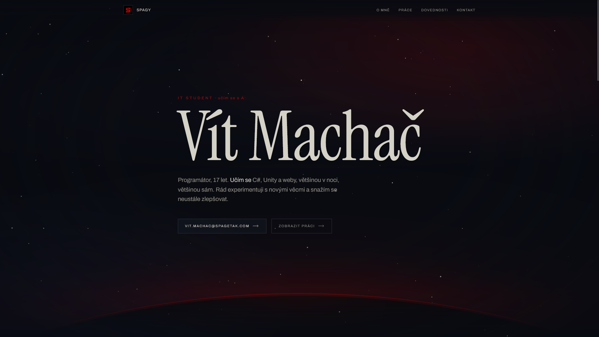 | 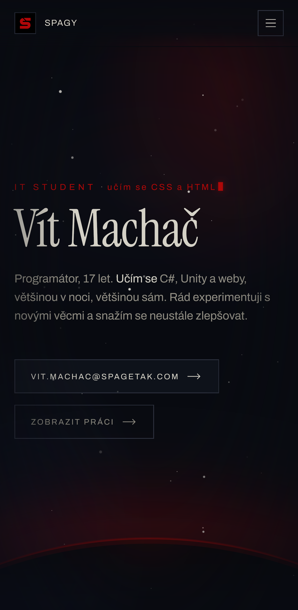 |
| 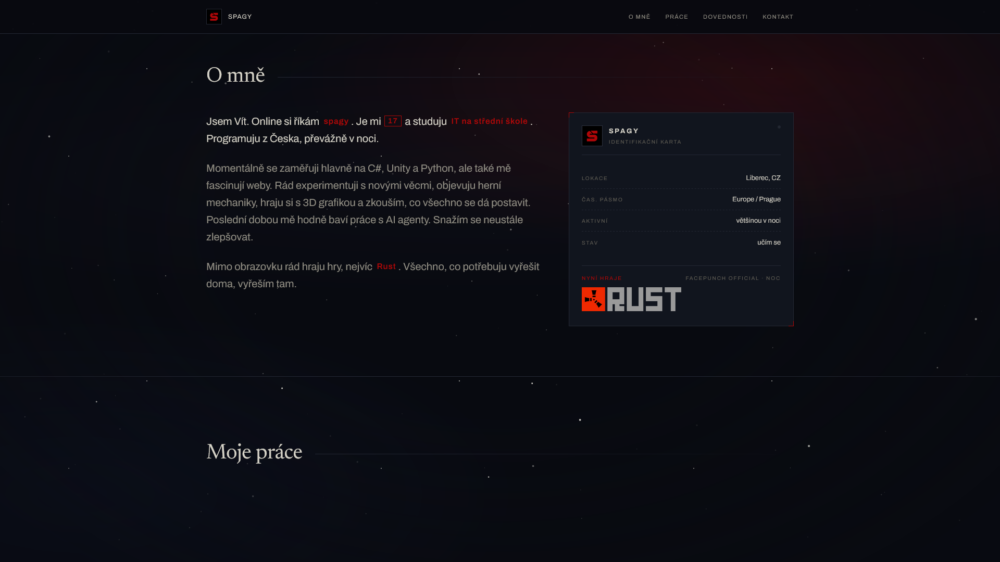 - text + identifikační karta | 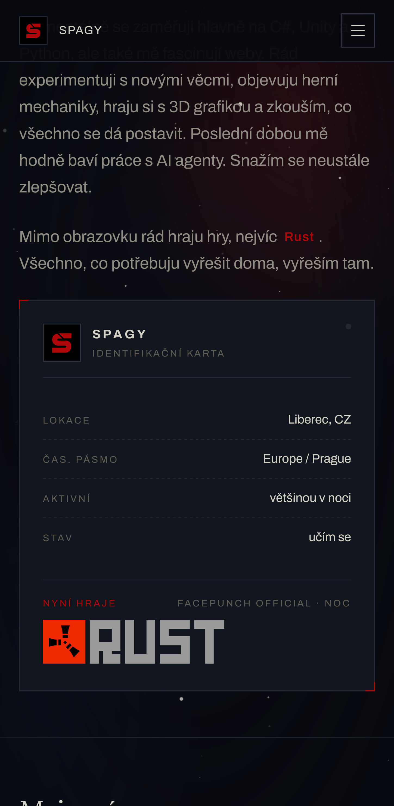 - stackuje pod sebe |
| 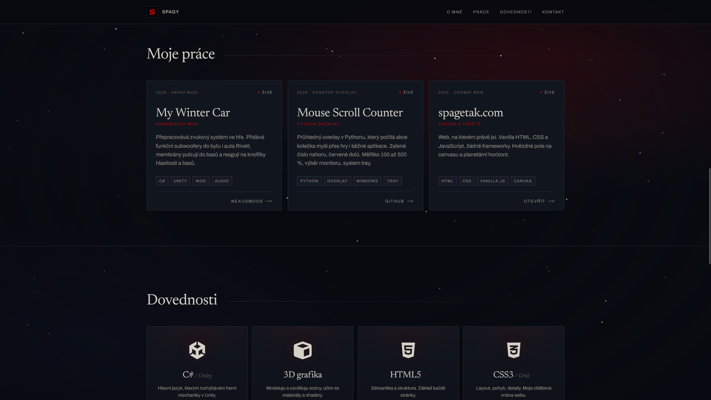 - 3 sloupce | 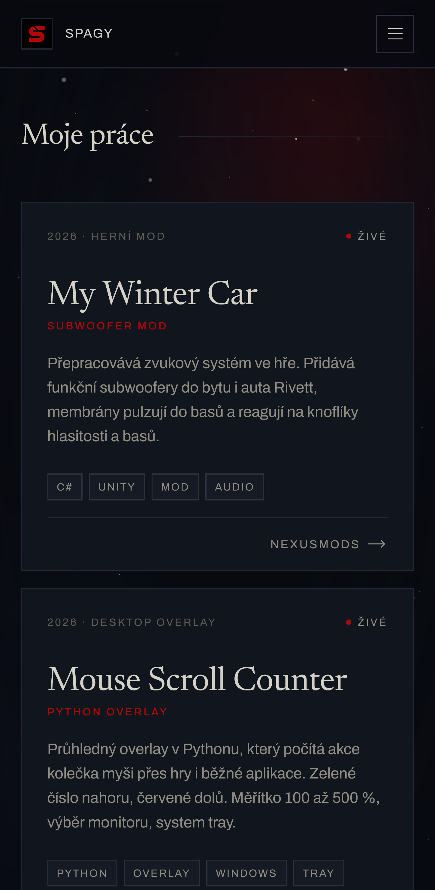 - 1 sloupec |
| 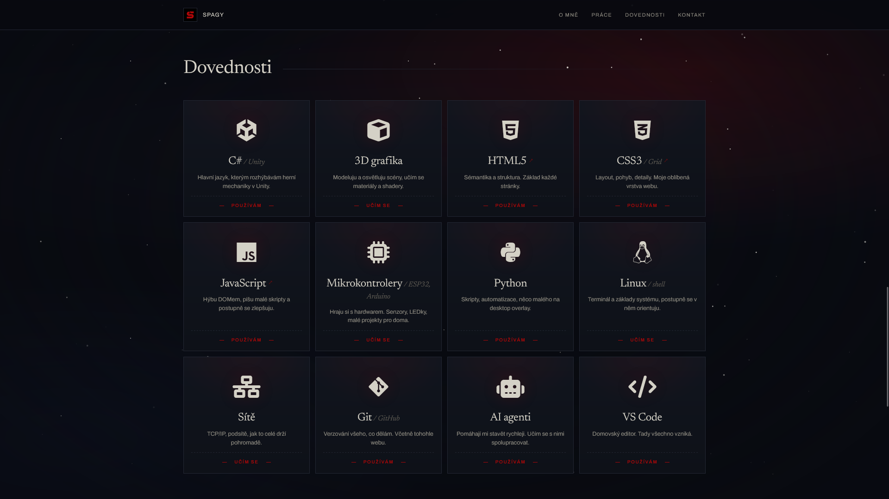 - 4 sloupce katalogových karet | 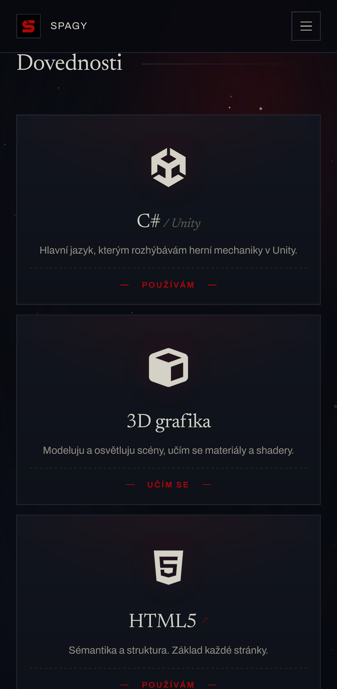 - 1 sloupec |
| 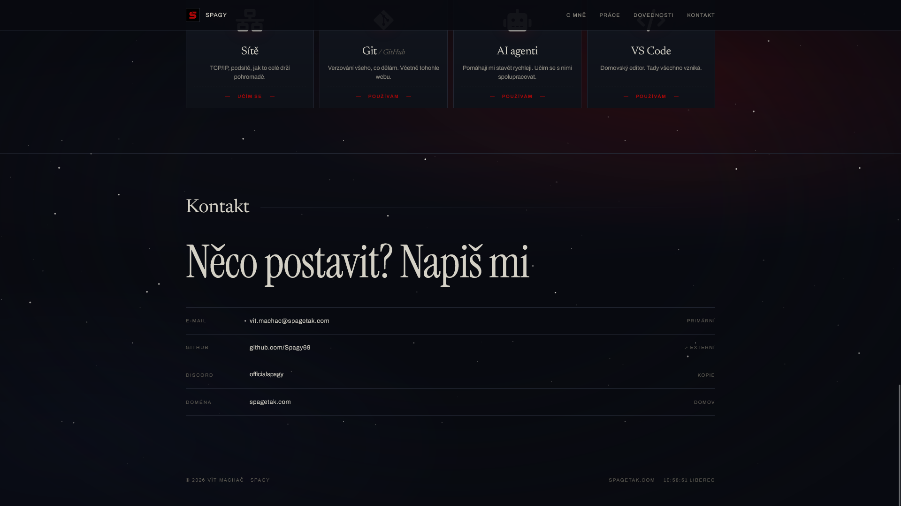 - kontaktní řádky | 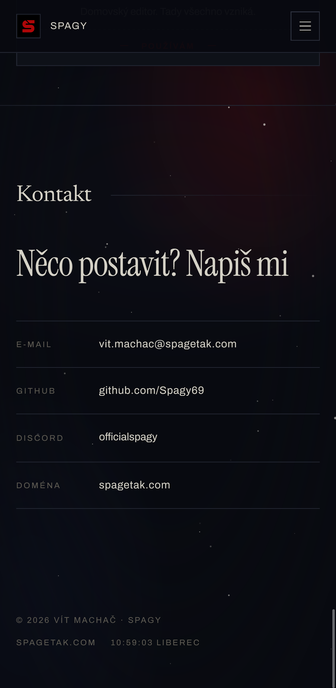 |

---

## Hodnoticí kritéria - kde to najít

| Kritérium | Kde v repu / Jak je splněno |
|---|---|
| **Funkčnost a validita** | Celý web je napsán validním kódem, `index.html` projde [W3C HTML Validator](https://validator.w3.org/) bez chyb. CSS3 využívá moderní a plně podporované standardy. |
| **Kvalita optimalizace** | Vynikající výsledky v testu Lighthouse (Performance / Accessibility / Best Practices / SEO) - viz detailní rozbor v §4. Žádné těžké externí knihovny, 1 CSS soubor a optimalizované WebP obrázky s pevnými rozměry. |
| **Hloubka dokumentace** | Tato dokumentace (README.md) podrobně rozebírá všech 6 povinných technických oblastí optimalizace s ukázkami zdrojového kódu (§4) a obsahuje přehledný AI Deník (§5). |
| **Vizuální úroveň** | Působivý a atmosférický design postavený na motivu vesmíru, tlumeném hvězdném poli a planetárním horizontu s tenkou červenou atmosférou. Žádné generické šablony ani levné efekty. |

---

© 2026 Vít Machač
